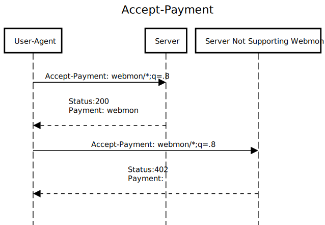

# Accept-Payment Header

It would be nice to let the server know what kinds of monetization methods a user desires. These could be used in conjunction with response status codes and headers to negotiate a payment method acceptable to both the user agent and the server.

