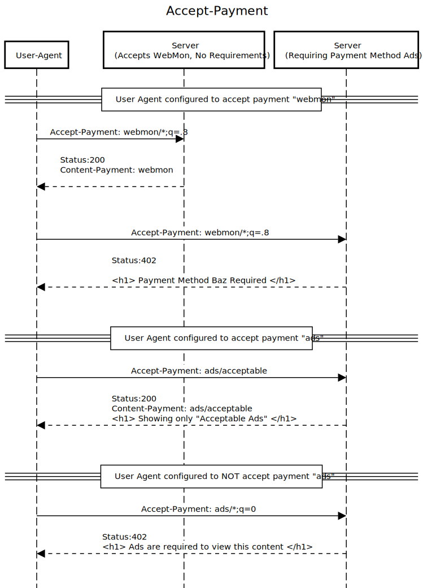

# Accept-Payment Header

[Content Negotiation](https://developer.mozilla.org/en-US/docs/Web/HTTP/Content_negotiation) has been used by web browsers and servers as a means of serving different forms of content located at a single URI. The Content Negotiation ecosystem includes `http headers`:

| Header            | Usage                    |
| ----------------- | ------------------------ |
| `Accept`          | Format/Mime Type         |
| `Accept-Charset`  | Character Encoding       |
| `Accept-Language` | Natural Language         |
| `Accept-Encoding` | Compression capabilities |

This proposal suggests to expand Content Negotation with the addition of a further header, `Accept-Payment` to convey a client's payment (monetization) preference.

| Header           | Usage                   |
| ---------------- | ----------------------- |
| `Accept-Payment` | Monetization preference |

## Motivation

It would be nice to let the server know what kinds of monetization payment methods a user desires. These could be used in conjunction with response status codes and headers to negotiate a payment method acceptable to both the user agent and the server. Different user experiences and content payloads can be served for a client that does not wish to be served ads, for instance.



## Example: Chosen Payment method

When a client and server are able to agree on a payment method, the server should return the chosen payment method in its response headers:

Client:

```
Accept-Payment: webmon/*;q=.8
```

Server:

```
HTTP/1.1 200 Ok
Content-Payment: webmon
```

If multiple versions of a URI are served depending on the state of the `Accept-Payment` header, then the server should also add to the `Vary` header so that caches are correctly storing the response:

```
HTTP/1.1 200 Ok
Content-Payment: webmon
Vary: Accept-Payment
```

## Example: Failed Negotiation

A user could convey a preference for certain types of ads or web passes using this header as well:

```
Accept-Payment: ads/*;q=.1
```

If a server is not able to fulfil the client's request, it can use HTTP status codes to indicate this to the client:

```
HTTP/1.1 402 Payment Required
Content-type: text/html
.
.
.
<p>No content is available that matches your Payment Preferences</p>
```

## Discussion

Without making payment preferences explict, the client code is left to guessing, which can cause unneccessary burdens to be placed on the client–for instance loading large amounts of advertising and tracking code when the user does not desire to support the website in this manner. Client code is then left to probe to see if a user has an ad blocker installed so that it can fix rendering mistakes caused by missing ads.

This proposal imagines another, opportunistic way of rendering the page. The user agent passes along the user's payment desires–possibly modifed by numerous browser extensions installed by the user–to the server which can then choose the best response for the user, or indicate that there's a mismatch between client and server's capabilities. This author believes that the best way forward is to have a conversation between user and website as to how the user wants to support the website, if at all.

It's often asked what about "bad actors"–those that claim they have a certain desired payment method, but don't actually have this capability? For instance, you could imagine a client sending along a header: `Accept-payment: */*`, which would say "I'm ok with any kind of payment method". The server would then opportunistically choose its preferred payment method, and presumably there is an interaction on the client to initate this payment–for instance, the page knows that an ad should load, or web monetization extension should be detectable via JavaScript. In the case that a client can't start the payment method, the user interface could say as much (much like happens now with ad block detectors) or simply reload the page.

It should be noted that no privacy information is given up with the addition of this header, because client-side code can already detect the presence of ad blockers or other client-side requirements for payment, implemented via cookies, browser extensions, or other methods.

By making use of http status code 402, `Vary:`, `Content-Payment:` (server side) and `Accept-Payment:` (client) the parties can negotiate the best possible outcome that maximizes experience.

# Demo

```
npm install
npm run start
```

# Resources

- [Is it time for the 402 status code and Accept-Payment?](https://www.notion.so/Is-it-time-for-the-402-status-code-and-Accept-Payment-513ede526d954e6f81f01c13a144e26a)

# Contact

Matt Mankins <mankins@mozillafoundation.org>
